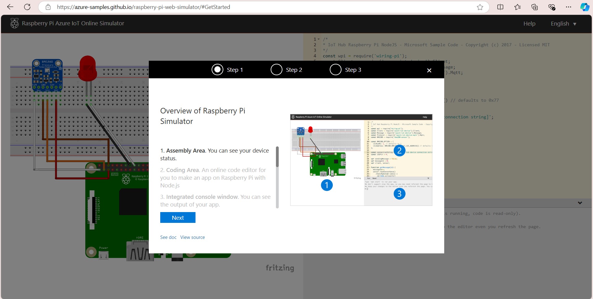

# Paso 1: Simulador de Dispositivos IoT

Se puede implementar la generación de los datos de dos maneras:

1. **Mediante el simulador online de Raspberry Pi**: Puedes seguir la guía disponible en [Microsoft Learn](https://learn.microsoft.com/es-es/azure/iot-hub/raspberry-pi-get-started) para aprender cómo hacerlo.



2. **Generación de datos aleatorios**: Esta opción se puede lograr utilizando un script de Python, específicamente el archivo `simulador.py`.

```python
import random
import time
import json
from azure.iot.device import IoTHubDeviceClient, Message  # type: ignore

# Reemplaza con tu cadena de conexión del IoT Hub
connection_string = "HostName=IoT-proyect.azure-devices.net;DeviceId=SensoreTempyHum;......."
client = IoTHubDeviceClient.create_from_connection_string(connection_string)

def generate_random_data():
    """Genera datos aleatorios de temperatura y humedad."""
    temperature = random.uniform(15.0, 30.0)  # Temperatura en °C
    humidity = random.uniform(30.0, 70.0)      # Humedad en %
    return {
        "deviceId": "SensoreTempyHum",
        "temperature": round(temperature, 2),
        "humidity": round(humidity, 2)
    }

try:
    while True:
        data = generate_random_data()
        message = Message(json.dumps(data))  # Formatea el mensaje como JSON
        
        # Intentar enviar el mensaje
        try:
            client.send_message(message)
            print(f"Sent message: {json.dumps(data, indent=2)}")  # Salida formateada
        except Exception as e:
            print(f"Error sending message: {e}")
        
        time.sleep(5)  # Envía cada 5 segundos
except KeyboardInterrupt:
    print("Simulación detenida.")
finally:
    client.shutdown()
``` 
Tener en cuenta que para ambos caso se debe modificar el `connection_string` pues será el medio por el cual se enlazará la simulación del dispositivo con el servicio de Azure IoT Hub. 